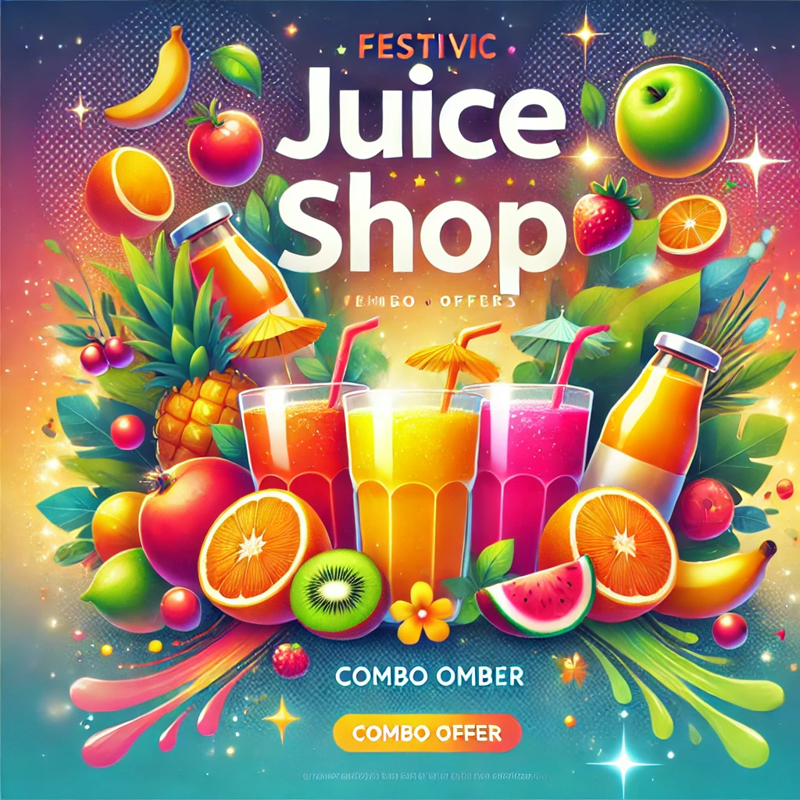

## Blogs

<a href="https://seraialization.hashnode.dev/understanding-serialization" target="_blank">
<h3 style= "color:white">Serialization</h3>

</a>
<a target="_blank">
<h3 style= "color:white" href="https://vanilla-css-intro.hashnode.dev/exploring-vanilla-css">Exploring Vanilla Css</h3>

</a>
<a target="_blank" href="https://javascript-ipl-trophy.hashnode.dev/impact-of-javascript-on-ipl">
<h3 style= "color:white">Javscript Ipl</h3>

</a>
<a target="_blank" href="https://juicepoint-prd.hashnode.dev/juice-shop-prd">
<h3 style= "color:white">Juice shop PRD</h3>

</a>

