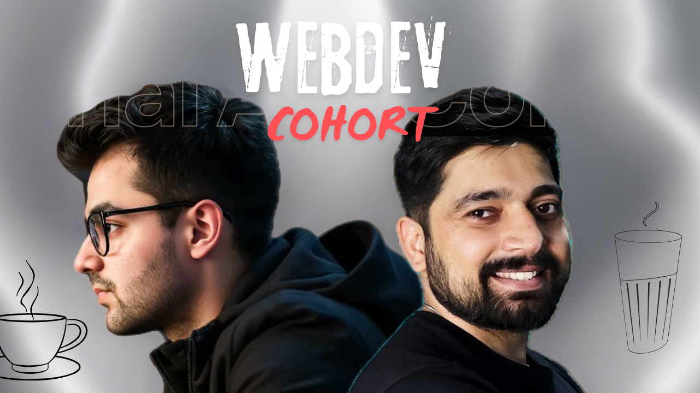

Webdev-Cohort
=============

&nbsp;&nbsp;&nbsp;&nbsp;&nbsp;&nbsp;&nbsp;&nbsp;

## Intro
**Webdev-cohort** is a Full stack Web development course by [Hitesh sir](https://hiteshchoudhary.com/) and [Piyush_Garg sir](https://www.piyushgarg.dev/) where they will teach every concept from Basics to Masters. This repository tracks My course Progress. 

## Docs
- ### blogs - Showcase
- ### Challanges - learn
- ### ui clone - made
- ### Polyphils - jsArray

## Tech-stack
- ### Html5 - structuring
- ### Css3 - styling
- ### Js - movable objects
- ### Git - version control

